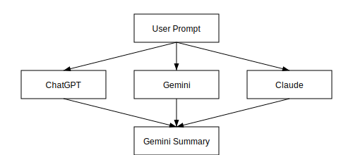

# ChatDelta - Multi-AI Platform

**ChatDelta** is a comprehensive suite of tools and libraries for connecting to multiple AI APIs with a unified interface. Whether you need a terminal interface, a library for your application, or a command-line tool, ChatDelta has you covered.

## 🚀 Our Ecosystem

### Terminal Interface
**[ChatDelta TUI](https://github.com/ChatDelta/ChatDelta)** - Side-by-side chat with OpenAI, Gemini, and Claude
- Real-time terminal interface with three columns
- Asynchronous responses from multiple AI providers
- Shared input for consistent questioning across models

### Libraries & SDKs

#### JavaScript/TypeScript
**[chatdelta](https://www.npmjs.com/package/chatdelta)** - NPM package with TypeScript support
- Unified interface for OpenAI, Gemini, and Claude APIs
- Parallel execution and response summarization
- Built-in error handling and retry logic

#### Rust
**[chatdelta](https://crates.io/crates/chatdelta)** - Rust crate for AI API integration
- Async/await with tokio runtime
- Comprehensive error handling and retry logic
- Streaming responses and conversation support

#### Go
**[chatdelta-go](https://pkg.go.dev/github.com/chatdelta/chatdelta-go)** - Go library (in development)
- Full Go type safety with comprehensive interfaces
- Streaming support and conversation handling
- Environment integration and parallel execution

### Command Line Tools
**ChatDelta CLI** - Command-line tool for querying multiple AI models
- Parallel queries with optional response summarization
- Multiple output formats (text, JSON, markdown)
- Built-in connectivity testing and model listing

## 🎯 How ChatDelta Works

Below is a high-level flow showing how ChatDelta connects to multiple AI providers:



## 🛠️ Quick Start

### For Developers

#### JavaScript/Node.js
```bash
npm install chatdelta
```

```javascript
import { createClient, executeParallel } from 'chatdelta';

const openai = createClient('openai', process.env.OPENAI_KEY, 'gpt-4');
const results = await executeParallel([openai], 'Explain quantum computing');
```

#### Rust
```toml
[dependencies]
chatdelta = "0.2"
```

```rust
use chatdelta::{create_client, ClientConfig};

let client = create_client("openai", "your-key", "gpt-4o", config)?;
let response = client.send_prompt("Hello, world!").await?;
```

#### Go
```bash
go get github.com/chatdelta/chatdelta-go
```

```go
client, err := chatdelta.CreateClient("openai", "", "gpt-3.5-turbo", nil)
response, err := client.SendPrompt(context.Background(), "What is AI?")
```

### For End Users

#### Terminal Interface
```bash
git clone https://github.com/ChatDelta/chatdelta.git
cd chatdelta
cargo build --release

# Set your API keys
export OPENAI_API_KEY="your-key"
export GEMINI_API_KEY="your-key"  
export ANTHROPIC_API_KEY="your-key"

./target/release/chatdelta
```

## 🌟 Key Features

- **Unified Interface** - Same API across all providers and languages
- **Parallel Execution** - Query multiple AI models simultaneously
- **Comprehensive Error Handling** - Detailed error types with retry logic
- **Streaming Support** - Real-time response streaming where available
- **Open Source** - MIT licensed with active community development
- **Cross-Platform** - Works on Windows, macOS, and Linux

## 📚 Documentation

- **Terminal App**: [ChatDelta TUI Documentation](https://github.com/ChatDelta/ChatDelta/blob/main/README.md)
- **JavaScript SDK**: [NPM Package](https://www.npmjs.com/package/chatdelta)
- **Rust Library**: [Crates.io Documentation](https://docs.rs/chatdelta)
- **Go Library**: [Go Package Documentation](https://pkg.go.dev/github.com/chatdelta/chatdelta-go)

## 🤝 Community & Support

- **GitHub**: [ChatDelta Organization](https://github.com/ChatDelta)
- **Issues**: Report bugs and request features on individual repository issue trackers
- **License**: MIT License across all projects

---

**Ready to get started?** Choose your preferred language or tool above and dive into the comprehensive ChatDelta ecosystem!
