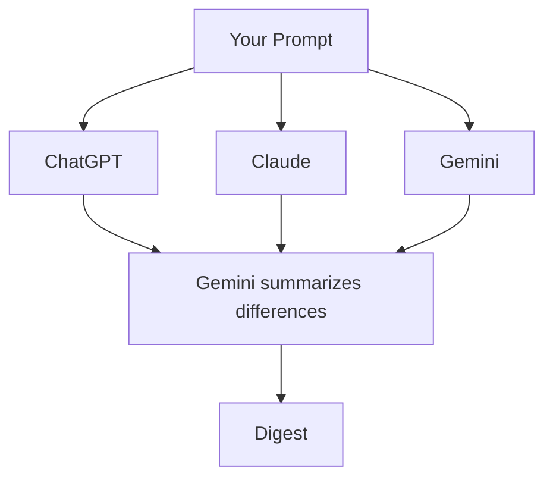

# ChatDelta

ChatDelta is an open source command line tool for comparing responses from multiple AI models. This site hosts the documentation and quick start guide.

## Getting Started

1. Install [Rust](https://www.rust-lang.org/tools/install).
2. Clone the repository and build the binary:
   ```bash
   git clone https://github.com/ChatDelta/chatdelta.git
   cd chatdelta
   cargo build --release
   ```
3. Set your API keys as environment variables and run the CLI:
   ```bash
   OPENAI_API_KEY=... GEMINI_API_KEY=... ANTHROPIC_API_KEY=... ./target/release/chatdelta "Your prompt"
   ```
4. Your prompt is sent to each API, and then all the responses are fed into Gemini with instructions to summarize the differences.

## Diagram



For full usage details see the [README on GitHub](https://github.com/ChatDelta/ChatDelta/blob/main/README.md).

<script src="https://cdn.jsdelivr.net/npm/mermaid/dist/mermaid.min.js"></script>
<script>mermaid.initialize({startOnLoad:true});</script>
